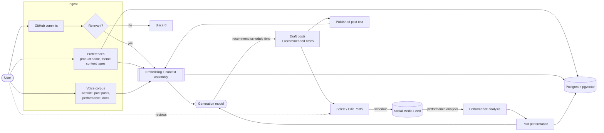

# Architecture

> Builder's tool that turns your commits into posts — automatically, in the background, while you build. This document is the implementation brief for the coding agent. Decisions marked **[ASSUMPTION]** are defensible defaults the agent should follow unless overridden; decisions marked **[OPEN]** are flagged at the bottom and should be confirmed before building that slice.

---

## 1. What we're building (context for the agent)

We connect to a founder's GitHub repos, read their commits, and turn meaningful build activity into ready-to-post social content in *their* voice. We are not a commit-to-caption converter. The defensible work happens *before* a post is written:

- **Narrative grouping** — cluster related commits into one coherent story, not fragmented noise.
- **Intent inference** — read across commits to understand *what problem was being solved*, not just what changed.
- **Voice calibration** — output reflects how the user writes, not how an LLM defaults to writing.
- **Platform awareness** — LinkedIn gets a reflective, lesson-framed post; X gets something punchy and direct. Same week of work, shaped per platform.
- **Smart filtering** — dependency bumps and routine chores never become content; meaningful progress does.
- **Improvement over time** — the more it's used, the better it sounds like the user and the better it understands which posts perform.

The narrative-intelligence layer + the per-user voice + the performance feedback loop **are the moat**. Treat them as first-class subsystems, not prompt afterthoughts.

**Build-quality bar:** technical founders have a finely tuned radar for things that don't respect how they actually work. Default output should be good enough to publish with light editing, never a wall of robotic "I just shipped X" announcements.

---

## 2. End-to-end flow (from the flowchart)

Plain-language trace:

1. **Ingest** three sources: GitHub commits (gated by a relevance check), user **preferences** (product name/theme, desired content types), and the **voice corpus** (website, past posts + their performance, uploaded docs).
2. **Embed + assemble context**, persist to a vector-enabled store.
3. **Generate** drafts + a recommended schedule time, conditioned on retrieved context *and* past performance.
4. User **selects / edits** drafts, then **schedules** them to the social feed.
5. **Performance analysis** of published posts flows back into "past performance," which feeds future generation. Published post text also flows back into the voice corpus so the system keeps learning the user's voice.

---

## 3. Subsystems

### 3.1 GitHub ingestion
- Connect via a **GitHub App** (not a personal OAuth token) so we can scope per-repo access, get webhooks, and refresh installation tokens. **[ASSUMPTION]**
- Two ingestion paths: **webhook** (`push` events) for near-real-time, plus a **polling/backfill** job for first connect and gap recovery.
- Capture per commit: sha, message, author, timestamp, branch, changed file paths + stats (additions/deletions), and the PR it belongs to if any. Pull the **diff summary** (not full diffs by default — too large/noisy; fetch diff bodies lazily only for commits that survive filtering). **[ASSUMPTION]**
- Store raw commits immutably; the pipeline reads from there so we can reprocess when prompts/models improve.

### 3.2 Relevance filter ("If Relevant" → Smart filtering)
- A gate that runs *before* expensive generation. Drops: dependency bumps, lockfile/format-only changes, merge commits, version bumps, CI/config churn, "wip"/"fix typo"-class commits.
- Implementation: cheap heuristics first (path globs like `package-lock.json`, `*.lock`, conventional-commit `chore(deps)`, tiny diffs), then a lightweight LLM/classifier pass on the survivors for judgment calls. **[ASSUMPTION]**
- Output is a relevance score + reason, stored on the commit. Tunable threshold per user.

### 3.3 Context & voice store (Embedding → Database)
- Single store: **Postgres + pgvector**. Keeps voice corpus, preferences, commit context, and post history in one queryable place at our scale — avoid a separate vector DB until we outgrow it. **[ASSUMPTION]**
- Embed and index: voice corpus chunks (website copy, past posts, uploaded docs), and published posts (so the system learns from what the user actually shipped).
- Preferences are structured config, not embeddings — store as columns/JSON and inject directly into prompts.
- Retrieval at generation time: pull the most voice-representative past posts + any relevant docs to ground tone and substance.

### 3.4 Generation pipeline (the AI Model node)
This is a **multi-step pipeline**, not one prompt. Each step is independently observable and re-runnable. **Generation is user-triggered [DECIDED]:** commit ingestion (§3.1) and filtering (§3.2) run continuously in the background, but the pipeline below fires when the user asks for posts (e.g. "draft from this week's work") — not automatically per push or on a cadence. The background part is collecting and grading the raw material; the user decides when to turn it into drafts.

1. **Group** — cluster the candidate commits (by PR, time window, file/feature overlap, semantic similarity) into one or more narrative units.
2. **Infer intent** — for each group, derive the *why*: what problem, what changed for the user, why it matters.
3. **Draft** — write the post, grounded in retrieved voice examples + preferences + content-type intent (founder-led / marketing / feature / poll).
4. **Shape per platform** — produce LinkedIn and X variants from the same source story (reflective/lesson-framed vs punchy/direct).
5. **Recommend schedule time** — propose a send time using past-performance signals (best-performing windows for this user/platform), with a sensible cold-start default. **[ASSUMPTION: rule-based on past performance first; learned model later.]**

Use a durable, step-based workflow so a failure in step 4 doesn't lose steps 1–3, and so we can replay a single step when we improve a prompt.

### 3.5 The 20 human-written commit→post examples — **few-shot exemplars** [DECIDED]
We have 20 gold examples of commits mapped to the posts a human wrote from them. **Use them as few-shot exemplars:** at draft time (§3.4 step 3), retrieve the 2–3 most relevant examples — by content type and by similarity to the current commit group — and include them in the prompt to anchor structure, framing, and voice. Cheap, immediate quality lift, no training required.

Implementation notes:
- Store the 20 as structured `(commit_context, platform, post_text, content_type)` records so they're retrievable, not pasted statically into one prompt. This lets selection adapt to the post being written (e.g. a feature commit pulls feature-style exemplars).
- Embed each exemplar's commit context so retrieval is by semantic similarity, not just content-type match.
- They're a fixed seed for now; the per-user voice corpus (past posts) supplements them, and the accept/edit signals (§3.6) become the path to growing this set later.

### 3.6 Review, edit, schedule (Select/Edit Posts → Social Media Feed)
- User sees drafts (per platform), edits inline, approves or rejects.
- **Every edit and every reject is a training signal** — diff the user's edit against our draft and store it. This is the cheapest, richest voice/quality signal we get. Capture it from day one even if we don't use it yet.
- Approved posts get scheduled. **Publishing is staged [DECIDED]:**
  - **MVP — share-out, no API publish.** The app generates the platform-shaped post; the user reviews/edits, then taps a **share button** that hands the text off to the target platform (native share sheet / platform share intent / one-tap copy-and-open). No write-access API integration required to ship. This sidesteps the LinkedIn/X API approval risk entirely (§6) and lets us validate output quality first.
  - **Target architecture — approve → schedule → auto-publish.** Once platform write access is in place, approved posts enter a scheduled-publish queue that posts at the recommended/chosen time via the platform APIs. The data model (`posts.status`, `scheduled_time`, `external_post_id`) already supports this so the MVP doesn't paint us into a corner.
  - The MVP is a *progressive* slice, not the product's final form — build the publishing layer behind an abstraction (§6) so the share-button path and the scheduled-API path are two implementations of the same interface.

### 3.7 Feedback loop (Performance Analysis → Past Performance)
- After publish, periodically pull engagement metrics per post (impressions, reactions, comments, reshares, clicks where available).
- Aggregate into per-user "past performance": which content types, formats, lengths, topics, and time windows perform.
- Feed this into (a) schedule-time recommendation and (b) generation as soft guidance ("your teardown-style posts outperform announcements"). Store published post text back into the voice corpus.

---

## 4. Data model (core tables, indicative)

- `users`, `accounts` (auth + billing tier: solo / team seat)
- `github_installations`, `repos`
- `commits` (raw, immutable) — sha, repo_id, message, files, stats, ts, relevance_score, relevance_reason
- `commit_groups` — narrative units; many-to-many with commits; inferred_intent
- `preferences` — product_name, theme, enabled_content_types, platform settings (JSON)
- `voice_documents` — source type (website/past_post/upload), raw text, metadata
- `embeddings` — pgvector; polymorphic ref to voice_documents / published posts
- `posts` — group_id, platform, status (draft/approved/scheduled/published/rejected), generated_text, edited_text, recommended_time, scheduled_time, published_at, external_post_id
- `post_edits` — draft vs final diff (training signal)
- `post_performance` — post_id, metric snapshots over time
- `generation_runs` — pipeline run log, step inputs/outputs, model + prompt version (for eval + replay)

---

## 5. Recommended stack **[ASSUMPTION — confirm in §8 Q1]**

- **Language/monorepo:** TypeScript, pnpm workspaces.
- **Web app + API:** Next.js (App Router). Server actions / route handlers for the API.
- **Background jobs & scheduling:** a durable workflow/queue (e.g. Inngest or Trigger.dev) — fits the "react to webhook → multi-step LLM pipeline → schedule a future publish" pattern far better than raw cron. Avoids hand-rolling retries/replay.
- **DB:** Postgres (Supabase or Neon) + **pgvector**.
- **LLM (generation):** the voice quality bar argues for a strong model; provider abstracted behind one interface so we can swap/route. **[OPEN — Q1]**
- **Embeddings:** a dedicated embeddings model, abstracted the same way.
- **Auth:** Clerk or Auth.js + the GitHub App install flow.
- **Hosting:** Vercel (web) + the queue provider's workers; or a single Fly/Railway service if we want fewer moving parts early.
- **Observability:** structured logging on every `generation_run`, plus LLM-output tracing so we can debug bad posts.

---

## 6. Integration risks the agent should surface early
- **LinkedIn API**: posting on a user's behalf requires approved access to restricted scopes; the approval/partner process is slow and a real schedule risk. Plan a fallback (generate + one-tap copy, or scheduled draft) so the product works before API access lands.
- **X API**: write access is on paid tiers with rate limits; cost and limits affect the publishing design.
- Both argue for a **publishing abstraction**: the MVP ships the share-button path (no write access needed), and we swap in direct scheduled API publishing per platform as access is granted — without rewriting the approval/scheduling flow.

---

## 7. Suggested phasing
The MVP is a progressive slice we build toward the full shape — not the final product.
- **MVP (prove the moat):** GitHub connect → continuous background ingestion + relevance filter → **user-triggered** generation (group + intent + draft) → LinkedIn + X variants grounded in the 20 few-shot exemplars + voice corpus → review/edit → **share button** hand-off to the platform (no API publish). Capture every edit/reject signal.
- **V1:** approve → schedule → **auto-publish via platform APIs**, performance ingestion, schedule-time recommendation from real data.
- **V2:** voice fine-tuning / preference learning from accumulated accept/edit/performance signals; smarter grouping; optional cadence-based draft suggestions on top of manual triggering.

---

## 8. Decisions

**Settled:**
- **20 examples** → few-shot exemplars, retrieved per draft (§3.5).
- **MVP publishing** → generate + share-button hand-off; target architecture is approve → schedule → auto-publish, built behind one abstraction (§3.6).
- **Generation trigger** → user-triggered; ingestion/filtering run in the background (§3.4).

**Still open — confirm before building the relevant slice:**
1. **[Q1] LLM + embeddings provider** — pick the generation and embedding providers, and whether to abstract behind a router from day one.
2. **[Q4] Voice strategy** — RAG-from-corpus only for now, vs. plan for a per-user fine-tune once enough accept/edit data accrues.
3. **[Q6] Team seats** — multiple contributors / one repo → one shared voice or per-author voices?
4. **[Q7] "This week's work" definition** — when the user triggers generation, what's the default window/scope of commits we pull (since last drafted? last 7 days? a selectable range)?

---
*Last updated: June 2026 — implementation brief, subject to revision.*
