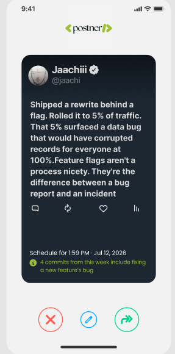
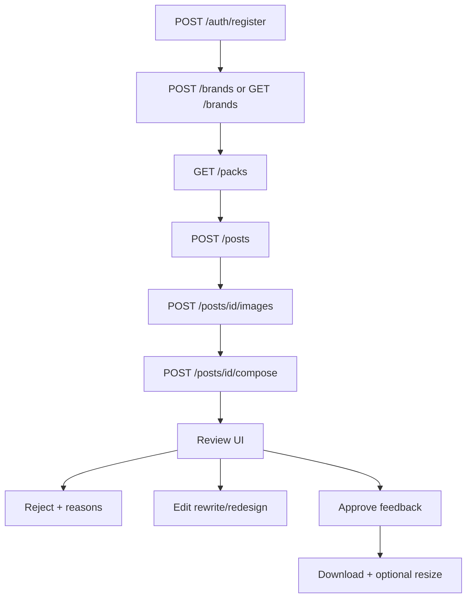

# Frontend guide: onboarding → first downloadable post

Per-screen field inventory (components, types, API bindings): [FRONTEND_SCREENS.md](./FRONTEND_SCREENS.md).

API base (local Docker): `http://localhost:8001`  
Interactive docs: http://localhost:8001/docs

Auth: send `Authorization: Bearer <access_token>` on all `/brands` and `/posts` calls.

---

## Product UI reference (review screen)

Primary review chrome for **mobile and desktop** — same three actions, responsive layout.



| Control | Color | Role (v1) |
|---|---|---|
| Left (X) | Red | **Reject with reason** |
| Center (pencil) | Blue | **Edit** (rewrite / redesign) |
| Right (arrow) | Green | **Approve**, then **download** (with resize). Later this becomes “approve for scheduling.” |

**Layout notes**

- **Mobile:** centered post card; FAB row fixed at bottom (as in screenshot).
- **Desktop:** same card + actions; widen content column (e.g. max-width ~480–560px for X-style, larger for carousel slides). Don’t hide the three actions behind overflow menus on first-run.

---

## End-to-end flow (first post)

Use the **full split pipeline**.



### Step 1 — Register / login

```http
POST /auth/register
{ "email": "you@example.com", "password": "••••••••", "name": "Jaachi" }
```

Response: `{ "access_token", "token_type": "bearer", "tenant_id", "user_id" }`  
Store `access_token`. Optional: `POST /auth/login` later; `GET /auth/me` to restore session.

### Step 2 — Brand onboarding

Users **must create a brand** — there is no seeded/demo brand in the product.

```http
GET /brands
```

Returns the tenant’s brands (often empty on first run). Create one:

```http
POST /brands
{
  "name": "Jaachi",
  "tagline": "...",
  "description": "...",
  "website": "https://example.com",
  "logo": null,
  "formats": ["x_post", "ig_portrait", "ig_feed"]
}
```

Use returned `id` (UUID) or `slug` as `brand_id` on posts. `formats` is the brand’s enabled canvases (ordered; **first is default**). New posts / resize must pick from this list. Do not proceed to New post until at least one brand exists.

### Step 3 — Pick a pack or template

```http
GET /packs
GET /templates
```

First-post recommendation: a pack (carousel) e.g. `lifestyle_tips` or `gentle_reminders`, **or** single template `basic` / `lifestyle_day`. Exactly one of `pack_id` | `template_id`.

Optional colors: `GET /variants?brand_id=<id>` (per-brand DB palettes) or `POST /variants/propose` with `brand_id` / `POST /packs/propose` (advanced; not required for first download).

### Step 4 — Draft (cheap)

```http
POST /posts
{
  "url": "https://example.com/blog/your-post",
  "brand_id": "<uuid-or-slug>",
  "pack_id": "lifestyle_tips",
  "format": "ig_portrait",
  "with_images": false
}
```

- Always: scrape + LLM → captions / slides.
- `with_images: false` keeps first draft cheap; generate photos next.
- Response: `id` (**post_id**), `status: "drafted"`, `content`, empty or partial `images`.

Show a loading state; draft can take several seconds.

### Step 5 — Source images (Recraft)

Skip if pack is text-only (`images: 0` on every page, e.g. `gentle_reminders`).

```http
POST /posts/{post_id}/images
{ "regenerate": false }
```

### Step 6 — Compose final PNG(s)

This is the **final rendered post image** (not Recraft alone).

```http
POST /posts/{post_id}/compose
{ "ensure_images": true }
```

- `ensure_images: true` fills missing photos once, then Playwright PNGs.
- Response `composed.pages[].url` (and `composed.page_paths`) are the URLs to preview/download.
  - With `STORAGE_BACKEND=s3`, these are public CDN/bucket URLs.
  - With `STORAGE_BACKEND=local` (default smoke), they stay as local filesystem paths.
- Poll or await; then open **Review UI** with composed preview.

### Step 7 — Review UI (screenshot)

Render the composed slide(s) or caption preview in the dark card. Wire the three buttons:

#### Reject (red)

Open a sheet/modal: reasons chips + optional note.

```http
POST /posts/{post_id}/feedback
{
  "decision": "rejected",
  "reasons": ["off_brand", "weak_hook", "bad_visual", "wrong_tone"],
  "note": "Too corporate",
  "page_id": null
}
```

Suggested UX: after reject, return to create flow or “try another pack/URL.”

#### Edit (blue)

Open edit panel:

| Intent | Route |
|---|---|
| Change copy | `POST /posts/{id}/rewrite` `{ "text"?, "caption"?, "suggest"?, "recompose": true }` |
| New colors | `POST /posts/{id}/redesign` `{ "variant_id"? , "propose": true, "recompose": true }` |
| New size only | Prefer download resize (below), or `POST .../resize` |
| Undo last edit | `POST /posts/{id}/undo` — restores previous full snapshot (content + composed) |
| History | `GET /posts/{id}/revisions` — `{ id, kind, version, created_at }[]` |

`needs_changes` feedback is available if you want to log “edited” without reject:

```http
POST /posts/{post_id}/feedback
{ "decision": "needs_changes", "reasons": [], "note": "..." }
```

#### Approve (green) → then download

**v1 (now):** green = approve, then show download UI.

```http
POST /posts/{post_id}/feedback
{ "decision": "approved", "reasons": [], "note": "" }
```

Post `status` → `approved`. Immediately open **Download** sheet (do not wait for scheduling).

**Later:** green becomes “approve for schedule”; download may move to a secondary control.

### Step 8 — Download (+ resize)

1. Show format picker (resize options):

| `format` | Size |
|---|---|
| `ig_feed` | 1080×1080 |
| `ig_portrait` | 1080×1350 |
| `ig_story` / `tiktok` | 1080×1920 |
| `fb_post` | 1080×1080 |
| `x_post` | 1600×900 |

2. If user picks a format different from `post.format`:

```http
POST /posts/{post_id}/resize
{
  "format": "x_post",
  "apply_to_post": true
}
```

3. Download the PNG(s) from `composed.pages[].url` (or `composed.page_paths`). For packs, zip or multi-file download of each page.

Optional polish (not required for first download): `POST /posts/{id}/animate` for MP4.

---

## Auth header example

```http
Authorization: Bearer eyJhbGciOi...
Content-Type: application/json
```

---

## Suggested screens (FE)

| Screen | Purpose |
|---|---|
| Register / Login | Step 1 |
| Brand setup | name, website, logo — Step 2 |
| New post | URL + pack/template + format — Steps 3–4 |
| Generating | Progress for draft → images → compose |
| **Review** | Screenshot UI — Step 7 |
| Reject sheet | Reasons + note |
| Edit sheet | Rewrite / redesign / undo |
| Download sheet | Format/resize + download CTA |

---

## Composed asset URLs

After compose (and recompose paths: resize / redesign / rewrite / animate), each page includes:

```json
{
  "page_id": "cover",
  "path": "/app/output/.../01_cover.png",
  "url": "https://cdn.example.com/tenants/.../v3/pages/01_cover.png",
  "key": "tenants/.../v3/pages/01_cover.png"
}
```

- FE should prefer **`url`** for `` and download.
- Storage is env-swappable (`STORAGE_BACKEND=local|s3`); S3-compatible backends (Cloudflare R2, AWS S3, MinIO) share the same code path.
- Recraft intermediates are **not** uploaded — only final compose PNG/MP4.

---

## Quick route cheat sheet

| Step | Method | Path |
|---|---|---|
| Register | POST | `/auth/register` |
| Login | POST | `/auth/login` |
| Me | GET | `/auth/me` |
| Brands | GET/POST/PATCH | `/brands`, `/brands/{id}` |
| Packs / templates | GET | `/packs`, `/templates` |
| Brand variants | GET | `/variants?brand_id=` |
| Propose variants | POST | `/variants/propose` (`brand_id` required) |
| Draft | POST | `/posts` |
| Photos | POST | `/posts/{id}/images` |
| Final PNG | POST | `/posts/{id}/compose` |
| Get state | GET | `/posts/{id}` |
| Reject / approve | POST | `/posts/{id}/feedback` |
| Edit copy | POST | `/posts/{id}/rewrite` |
| Edit look | POST | `/posts/{id}/redesign` |
| Resize | POST | `/posts/{id}/resize` |
| Animate | POST | `/posts/{id}/animate` |
| Undo | POST | `/posts/{id}/undo` |
| Revisions | GET | `/posts/{id}/revisions` |

---

## Example first-run payloads

**Draft pack**

```json
{
  "url": "https://example.com/blog/example",
  "brand_id": "<your-brand-uuid-or-slug>",
  "pack_id": "gentle_reminders",
  "format": "ig_portrait",
  "with_images": false
}
```

**Approve then resize to X**

```json
// POST /posts/{id}/feedback
{ "decision": "approved" }

// POST /posts/{id}/resize
{ "format": "x_post", "apply_to_post": true }
```

**Reject with reason**

```json
{
  "decision": "rejected",
  "reasons": ["wrong_tone"],
  "note": "Sounds like LinkedIn, not X"
}
```
